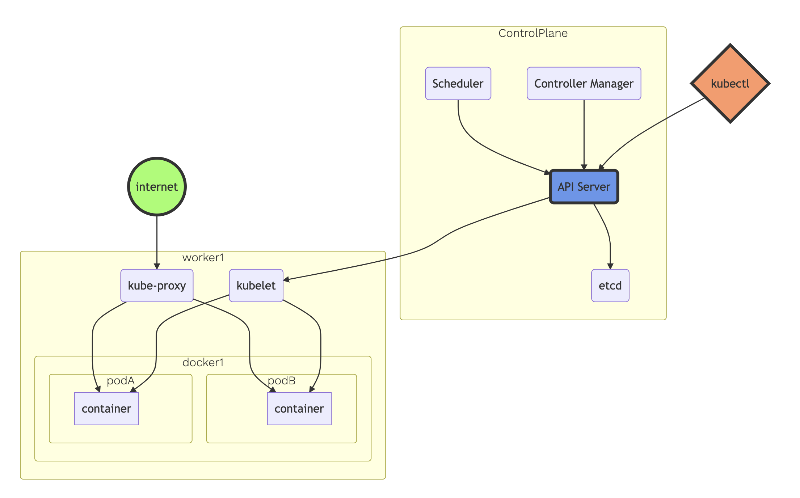

## Notes

**kubernetes architecture**

 
  

**chaos experiments**

As an industry, we are quick to adopt practices that increase the flexibility of developement and velocity of deployment. But how much confidence do we have on the complex systems we put out in production. Chaos engineering is the discipline of experimenting on a distributed system in order to gain confidence in a system's capability to withstand turbulent conditions in production. To address this uncertainty, we will be running a set of experiments to uncover systemic weaknesses.

In this experiment, we will be deploying two instances of the data pipeline, a control group and an experimental group. We also will define a 'steady state' which will indicate some sort of normal behavior for the pipeline. We will be running a set of tests on the experimental group which will try to disrupt the steady state, giving us more confidence in our system.

Experiment 1: Resource exhaustion of containers

hypothesis:

  - increased latency in incoming requests
  - load balancer routes traffic away from availability zone 2
  - receive alert message

Experiment 2: Kill Stateful Replica Pod

scenario: Master postres replica pod is killed

hypothesis:

  - brief unavailability of data for a x duration of time
  - replica should get promoted (slave to master)
  - new clone should kick off and system recovers

#### questions they may ask

**Why run stateful applications like Postgres on Kubernetes?**

  - simplify your development and deployment picture by putting all application components on Kubernetes
  - unified orchestration of stateless and stateful applications
  - LINK - [Considerations for running stateful apps on Kubernetes](https://www.altoros.com/blog/running-stateful-apps-on-kubernetes-with-statefulsets/)

**What type of load balancer am I using?**

**What other type of chaos testing can I apply on my deployment?**

**Why am I running the Spark cluster in one availability zone?**

  - performance?
  - latency?

**How would I improve my infrastructure?** 
  
  - knowing what I know now, how would I change the components (spark, postgres, flask) of my deployment?
  
**How does Spark on Kubernetes compare with yarn and mesos?**

**What metrics to collect for Chaos Engineering?**

  - Infrastructure Monitoring Metrics
    - Resource: CPU, IO, Disk & Memory
    - State: Shutdown, Processes, Clock Time
    - Network: DNS, Latency, Packet Loss
  - Alerting and On-Call Metrics
    - Total alert counts by service per week
    - Time to resolution for alerts per service
    - Noisy alerts by service per week (self-resolving)
    - Top 20 most frequent alerts per week for each service.
  - High Severity Incident (SEV) Metrics
    - Total count of incidents per week by SEV level
    - Total count of SEVs per week by service
    - MTTD, MTTR and MTBF for SEVs by service
  - Application Metrics
    - Events
    - Stack traces
    - Context
    - Breadcrumbs

#### things to keep in mind for presentation

  - make sure to mention that I am working on top of someone elses project

#### things to think about

  - be very valuable by mastering open source tools to help companies with vendor lock in
  - give kube more than it can handle by oversubscription (best practices)

#### references

  - [Principles of Chaos Engineering](http://principlesofchaos.org/?lang=ENcontent)
  - [awesome-chaos-engineering](https://github.com/dastergon/awesome-chaos-engineering)
  - [chaos engineering monitoring metrics guide](https://www.gremlin.com/community/tutorials/chaos-engineering-monitoring-metrics-guide/)
  - [Why run Spark on Kubernetes?](https://medium.com/@rachit1arora/why-run-spark-on-kubernetes-51c0ccb39c9b)

  - [create a production ready postgresql cluster bitnami kubernetes and helm](https://engineering.bitnami.com/articles/create-a-production-ready-postgresql-cluster-bitnami-kubernetes-and-helm.html)