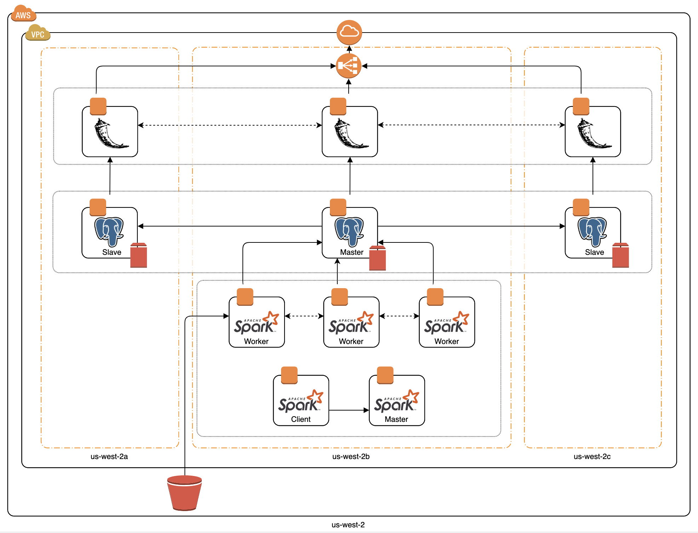
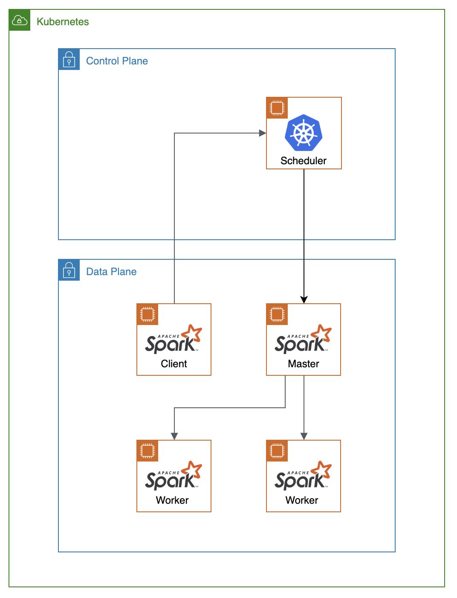
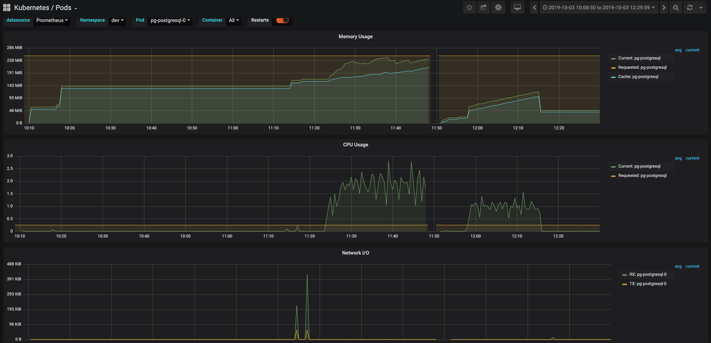

# insight-project
> chaos @ scale

## Table of Contents

  - [1.0 Introduction](README.md#introduction)
    - 1.1 Tech Stack
  - [2.0 Data Pipeline](README.md#data-pipeline)
    - 2.1 Overview - Scale
  - [3.0 DevOps Pipeline](README.md#devops-pipeline)
    - 3.1 Containerize Data Pipeline
    - 3.2 Deployment Architecture and Flow
    - 3.3 Monitoring
    - 3.4 Chaos Testing
  - [4.0 Engineering Challenges](README.md#engineering-challenges)
    - 4.1 Deployment of Kubernetes cluster
    - 4.2 Deployment of Spark on Kubernetes cluster
    - 4.3 Deployment of Postgres on Kubernetes cluster
    - 4.4 Flask App SQL Query to Postgres
  - [5.0 Future Work](README.md#future-work)
  - [6.0 Development](README.md#development)
    - 6.1 Build and Deploy Data Pipeline
  - [7.0 Miscellaneous](README.md#miscellaneous)
    - [7.1 Todo](TODO.md)
    - [7.2 Notes](NOTES.md)
    - [7.3 Permissions](PERMISSIONS.md)

## 1.0 Introduction

Having a resilient data pipeline for your business is becoming a necessity to stay competitive in times where vast amounts of data are generated and consumed. Containers allow you to focus on a single area of concern, whether it is application data capture, storage, analysis, or visualization. Container orchestrators like Kubernetes can help deploy, manage, and scale containerized components of modern cloud native data pipelines. So how do we test for resiliency?

My project focuses on taking a data pipeline, Scale, containerizing each component of the pipeline, utilizing container orchestration to create a highly resilient pipeline, and testing for resiliency by running a set of chaos experiments.

### 1.1 Tech Stack

  - Terraform
  - Kubernetes (AWS EKS)
  - Helm
  - Prometheus / Grafana
  - Data Pipeline: Spark, Postgres, Flask

## 2.0 Data Pipeline

### 2.1 Overview - Scale

The existing batch data pipeline is called Scale. It is a music recommendation engine that finds similar songs based on shared instruments. The original application can be found [here](https://github.com/mothas/insight-music-project). The data pipeline is shown below:

<p align="center"> 
  
</p>

  - S3: storage of midi files
  - Spark: extract data about instruments from midi files
  - Postgres: store results
  - Flask: view results

## 3.0 DevOps Pipeline

### 3.1 Containerize Data Pipeline

The Flask, Postgres, and Spark components of the data pipeline have all been containerized. You can find the containers used for my deployment on [Docker Hub](https://cloud.docker.com/u/ajgrande924/repository/list) or you can build your own containers by following the instructions in the development section.

### 3.2 Deployment Architecture and Flow

<p align="center"> 
  
</p>

The data pipeline flow is as follows:

  - The Lakh MIDI data set is loaded into an S3 bucket using the aws cli
  - The Spark Client submits a job to the spark cluster. 
  - The Spark Master delegates to the Spark Workers where the MIDI files are taken from the S3 bucket and instrument information is extracted.
  - Once instrument extraction is complete, the results are written by the Postgres Master.
  - Data is replicated from the Postgres Master to the Postgres Slaves.
  - The Flask app reads the data from the Postgres Cluster to enable the user to visualize the results.

### 3.3 Monitoring

In order to monitor the Kubernetes cluster and the components within it, I decided to use the Kubernetes Operator for Prometheus through Helm. The Prometheus Operator includes:

  - prometheus-operator
  - prometheus
  - alertmanager
  - node-exporter
  - kube-state-metrics
  - grafana

### 3.4 Chaos Testing

**Steady State Testing**


**Experiment #1: Terminate Pods in Availability Zone**

  scenario:
  
  hypothesis:
  
  execution:
  
  results:


## 4.0 Engineering Challenges

### 4.1 Deployment of Kubernetes cluster
  
I went through a few iterations when deploying my Kubernetes cluster to the cloud. I tried using both KOPS and AWS EKS. I decided to choose AWS EKS for a few reasons. The current data pipeline was also deployed on AWS with EC2 instances and the storage in which we will pull the data is also in AWS S3 which provides a much easier migration. AWS EKS is extremely simple to set up especially in conjunction with Terraform. There is actually a great module on the Terraform registry which allows you to use the base setup and spin up a cluster in 10 minutes. For time's sake, when you compare with KOPS, you do not have to provision anything in your control plane, you are only specifying your worker nodes. Also, one current downside to KOPS is that the terraform files generated for your cluster do not support `terraform>=0.12`. Since my terraform files are using the most up to date version of terraform, I did not want switch between versions to manage my infrastucture.
  
### 4.2 Deployment of Spark on Kubernetes cluster

Spark is an open source, scalable, massively parallel, in-memory execution engine for analytics applications. It includes prebuilt machine learning algorithms which the scale application utilizes. Why should we use the Kubernetes cluster manager as opposed to the Standalone Scheduler? 
  
  - Are you using data analytical pipeline which is containerized? Are different pieces of your application containerized utilizing modern application patterns? It may make sense to use Kubernetes to manage your entire pipeline.
  - Resource sharing is better optimized b/c instead of running your pipeline on a dedicated hardware for each component, it is more efficient and optimal to run on a Kubernetes cluster so you can share resources between components.
  - Utilizing the kubernetes ecosystem (multitenancy)
  - Limitations to the standalone scheduler still allow you to utilized Kubernetes features such as resource management, a variety of persistent storage options, and logging integrations.

<p align="center"> 
  
</p>

Currently as of `spark=2.4.4`, Kubernetes integration with Spark is still experimental. There are patches to the current version of Spark that can be added to make communication with the spark client and the kubernetes api server to work properly. Kubernetes scheduler will dynamically create pods for the spark cluster once the client submits the job. Communication with the spark cluster directly from the spark client is similar to the standalone scheduler but with utilization of some Kubernetes features such as resource management. It requires that the spark cluster is already up and running before you send the job.

### 4.3 Deployment of Postgres on Kubernetes cluster

### 4.4 Flask App SQL Query to Postgres

The query for the flask app route, `/get_songs_for_instruments`, does not work for the full set of 0 hash midi files:

```sql
SELECT fi.filename, hn.song_name,\
  COUNT(DISTINCT fi.instrument) num_of_instruments,\
  COUNT(fs.distance) / COUNT(DISTINCT fi.instrument) AS num_of_simSongs\
  FROM (SELECT filename FROM filename_instrument_run3 WHERE instrument = '0' ) tbl\
  JOIN hash_name hn ON hn.hash = tbl.filename\
  JOIN filename_instrument_run3 fi ON fi.filename = tbl.filename\
  JOIN filepair_similarity_run3 fs ON (fs."filename_A" = tbl.filename OR fs."filename_B" = tbl.filename )\
  GROUP BY fi.filename, hn.song_name;
```

Clicking multiple options in the instrument drop down caused the postgres database to increase in cpu as show below:

<p align="center"> 
  
</p>

The information of the run is listed below:
  
  - 395MB
  - 11,133 files
  - `midi_instrument`: 128 entries
  - `hash_name`: 178,561 entries
  - `filename_instrument`: 69,262 entries
  - `filepair_similarity`: 51,878 entries

When a subset of the 0 hash midi files was processed, the flask app was able to work fine. You can see the information below:

  - 1,000 files
  - `midi_instrument`: 128 entries
  - `hash_name`: 178,561 entries
  - `filename_instrument`: 6,205 entries
  - `filepair_similarity`: 447 entries

## 5.0 Future Work

  - [ ] move from AWS EKS to KOPS for more flexibility
  - [ ] convert deployment of instances within Kubernetes cluster to terraform
  - [ ] break up huge spark jobs into smaller ones to increase resiliency
  - [ ] update Spark deployment to communicate with Kubernetes scheduler to submit jobs instead of communicating with Spark master directly

## 6.0 Development

### 6.1 Build and Deploy Data Pipeline

I've seperated each piece of my build, deployment, and destroy steps into seperate subcommands for debugging purposes.

To build and deploy the data pipeline, you will need the following dependencies:

  - `jq`
  - `awscli`
  - `docker`
  - `kubetcl`
  - `helm`
  - `aws-iam-authenticator`
  - `terraform @ >= 0.12`

Before deploying the data pipeline, these are the steps to build / containerize the application:

| Step | Command | Description |
| :---: | :---- | :---- |
| 1 | `./run_kube create_scale_app` | containerize flask app |
| 2 | `./run_kube create_spark_base` | create spark base image |
| 3 | `./run_kube create_from_spark_base` | create spark master and worker images from base |
| 4 | `./run_kube push_to_docker_hub` | push images to docker hub |
| 5 | `./run_kube gen_pg_assets` | generate hash_names.csv w/ md5_to_paths.json as intermediate |

To deploy the data pipeline to a Kubernetes cluster, you can run the following steps:

| Step | Command | Description |
| :---: | :---- | :---- |
| 1 | `./run_kube setup_eks` | setup vpc + eks cluster |
| 2 | `./run_kube helm_init` | instantiate helm + tiller |
| 3 | `./run_kube setup_monitoring` | setup monitoring |
| 4 | `./run_kube setup_dashboards` | load custom grafana dashboards |
| 5 | `./run_kube setup_scale_app` | setup scale data pipeline |

To destroy the data pipeline, you can run the following steps:

| Step | Command | Description |
| :---: | :---- | :---- |
| 1 | `./run_kube cleanup_scale_app` | cleanup scale data pipeline |
| 2 | `./run_kube cleanup_dashboards` | delete custom grafana dashboards |
| 3 | `./run_kube cleanup_monitoring` | cleanup monitoring |
| 4 | `./run_kube cleanup_tiller` | cleanup tiller |
| 5 | `./run_kube cleanup_eks` | destroy eks cluster + vpc |

## 7.0 Miscellaneous
